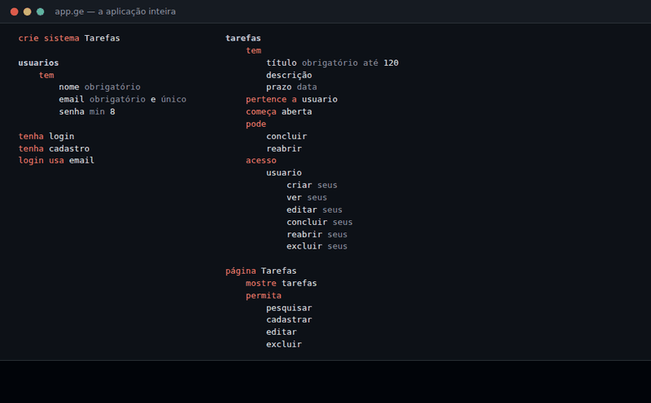

<p align="center">
  
</p>

<h1 align="center">Germanio</h1>

<p align="center">
  <strong>Uma linguagem de programação open source, orientada à intenção e construída em Go,<br>
  para criar aplicações reais com código simples, legível e determinístico.</strong>
</p>

<p align="center">
  <a href="https://github.com/flaviokalleu/germanio/actions/workflows/ci.yml"></a>
  
  
  <a href="LICENSE"></a>
</p>

<p align="center">
  <a href="#mostre-me">Mostre-me</a> ·
  <a href="#experimente">Experimente</a> ·
  <a href="examples/">Exemplos</a> ·
  <a href="#documentação">Documentação</a> ·
  <a href="#estado-do-projeto">Estado</a> ·
  <a href="CONTRIBUTING.md">Contribuir</a> ·
  <a href="README.md">English</a>
</p>

<p align="center">
  
  <br><sub>As 38 linhas de <a href="#mostre-me">Mostre-me</a>, rodando: cadastro, tarefas, concluir, e outra pessoa que não vê nada da primeira.</sub>
</p>

Você descreve **o que existe, quem pode fazer o quê, o que acontece e o que aparece**. O
Germanio transforma essa descrição numa aplicação web funcionando: banco de dados, validação,
login, permissões, mudanças de estado, uma API REST e páginas renderizadas no servidor.

**Sem IA dentro.** O compilador e o runtime são determinísticos: o mesmo arquivo `.ge`
sempre significa o mesmo programa, e `ge explain` mostra cada fato inferido e de onde ele
veio. Ferramentas de IA podem ajudar a escrever ou revisar `.ge`, mas o Germanio nunca
depende delas para entender ou executar um programa.

## Mostre-me

Esta é uma aplicação completa:

```ge
crie sistema Tarefas

usuarios
    tem
        nome obrigatório
        email obrigatório e único
        senha min 8

tenha login
tenha cadastro
login usa email

tarefas
    tem
        título obrigatório até 120
        descrição
        prazo data
    pertence a usuario
    começa aberta
    pode
        concluir
        reabrir
    acesso
        usuario
            criar seus
            ver seus
            editar seus
            concluir seus
            reabrir seus
            excluir seus

página Tarefas
    mostre tarefas
    permita
        pesquisar
        cadastrar
        editar
        excluir
```

O que está abaixo pertence ao que está acima: `tarefas › acesso › usuario › ver seus`
significa *um usuário pode ver as próprias tarefas*. `ge run app.ge` sobe a aplicação:
páginas de cadastro e login com sessão e proteção contra CSRF, a lista de tarefas com
pesquisa, formulários com validação, as transições *concluir* e *reabrir*, uma API REST e o
banco criado e migrado sozinho. Ninguém vê nem altera as tarefas de outra pessoa.

`ge explain tarefas app.ge` mostra o que o Germanio entendeu, inclusive os campos que ele
acrescenta sozinho (trecho):

```text
Campos:
  titulo                 texto, obrigatório, até 120
  prazo                  data
  usuario_id             referência a usuario, obrigatório
  estado                 texto, começa com aberta, mantido pelo sistema
  concluida_em           texto, mantido pelo sistema
Estados: começa aberta
  concluir → concluida (registra concluida_em e concluida_por_id)
  reabrir → aberta
Quem pode:
  ver            o dono/autor
  administrador  tudo
De onde vem cada fato (frase plana equivalente — origem):
  tarefa tem título obrigatório até 120 — app.ge:15 (tarefas › tem)
  tarefa pode concluir — app.ge:21 (tarefas › pode)
```

## Por que o Germanio existe

Uma aplicação web comum ainda exige conhecer HTTP, SQL, ORM, migrations, sessões, hash de
senha, CSRF, verificação de permissões, templates e um framework de frontend antes de
escrever a primeira regra do produto. O Germanio leva tudo isso para a implementação da
linguagem, onde é escrito uma vez e testado, com a segurança como padrão e não como
acréscimo ([o que está coberto e o que ainda está aberto](SECURITY.md)), e mantém o programa no nível
do produto: dados, pessoas, permissões, estados e páginas.

A regra que orienta o projeto: **Go constrói mecanismos; Germanio constrói produtos.** Quando
algo não pode ser dito de forma simples em `.ge`, a resposta é uma nova capability genérica
no core, nunca código da aplicação em Go. Para testar a ideia contra algo grande, o
repositório tem uma reimplementação dos conceitos centrais do [GitLab](examples/gitlab-foss)
em `.ge` (grupos, projetos, hospedagem Git, issues, merge requests e jobs de CI executados
pelo `gitlab-runner` oficial).

## Para quem é

- Pessoas que não programam e querem descrever uma aplicação real com precisão.
- Desenvolvedores que querem aplicações full-stack sem boilerplate de framework e que podem
  inspecionar tudo o que o compilador inferiu.
- Quem se interessa por design de linguagens: uma linguagem orientada à intenção, baseada em
  indentação e determinística, com especificação normativa e processo de evolução documentado.

## Experimente

Requisitos: [Go](https://go.dev/dl/) (a versão do [`go.mod`](go.mod)) e Git. Sem compilador C
e sem servidor de banco: o SQLite é embutido e escrito em Go.

```bash
git clone https://github.com/flaviokalleu/germanio.git
cd germanio
go build -o ge ./cmd/ge

./ge new minha_app              # app.ge, backend/, frontend/
./ge run minha_app/app.ge       # http://localhost:8080
```

Ou instale com o script (clona e compila em `~/.local/bin`):
`curl -fsSL https://raw.githubusercontent.com/flaviokalleu/germanio/master/install.sh | bash`.
Para rodar uma aplicação no Docker, veja o [Dockerfile](Dockerfile).
Binários prontos virão no próximo [release](https://github.com/flaviokalleu/germanio/releases)
(os releases v0.2–v0.6 são anteriores à mudança de nome e estão publicados como *Flang*).

| Comando | O que faz |
| --- | --- |
| `ge new <nome>` | Cria uma aplicação: `app.ge`, `backend/` (o que existe, quem pode) e `frontend/` (páginas) |
| `ge run [app.ge] [porta]` | Verifica e executa (porta 8080 por padrão; também `ge rodar`) |
| `ge check [app.ge]` | Verifica sem executar; os erros dizem o quê, onde, por quê e como corrigir |
| `ge explain <dado> [app.ge]` | Tudo o que o Germanio sabe de um dado e de onde vem cada fato |
| `ge fmt [caminho] [--check]` | Reescreve os arquivos na forma canônica única; recusa mudar o significado |
| `ge test [caminho]` | Executa os testes `.ge` de programas do núcleo (também `ge testar`) |
| `ge --version` | Mostra a versão |

`ge ajuda` lista tudo, inclusive os comandos do núcleo (`novo`, `explicar`) e os comandos
experimentais do Project Intelligence.

## Exemplos

| Exemplo | O que mostra |
| --- | --- |
| [examples/](examples/) | O índice dos exemplos executáveis, cada um com um README curto |
| [examples/gitlab-foss](examples/gitlab-foss) | O grande teste de estresse: conceitos do GitLab em `.ge` |
| [examples/germanio](examples/germanio) | Programas no núcleo tipado estrito (sem aplicação web) |

## Backend e frontend

Uma aplicação criada por `ge new` separa *o que existe e quem pode fazer o quê*
(`backend/`) de *o que aparece* (`frontend/`); o `app.ge` importa os dois. As páginas usam os
dados e as permissões já declarados: uma página nunca repete o schema nem verifica papéis à mão.

## Estado do projeto

O Germanio está em **pré-lançamento (antes da 1.0) e em desenvolvimento ativo**. O que
funciona hoje, com testes:

- a camada de intenção para aplicações web (dados, relações, validação, estados, login,
  cadastro, papéis, membros e herança, permissões e visibilidade, pesquisa, filtros,
  páginas, API REST para integrações, hospedagem Git, executores remotos de jobs);
- a sintaxe hierárquica e a forma plana equivalente;
- `ge check`, `ge explain`, `ge fmt` e mensagens de erro educativas;
- o núcleo tipado estrito para programas de terminal, com testes e cobertura ([SPEC.md](SPEC.md)).

Limites conhecidos, registrados em [GERMANIO_GAPS.md](GERMANIO_GAPS.md):

- **A camada de intenção só existe em português.** Programas com palavras-chave em inglês
  ainda não são entendidos (uma sintaxe técnica anterior aceitava vários idiomas; ela
  continua por compatibilidade, mas não é o nível padrão).
- As páginas ainda não têm indicadores, gráficos nem atualização em tempo real.
- Ainda não há language server, gerenciador de pacotes nem extensão do VS Code publicada (a
  extensão em [vscode-germanio](vscode-germanio) pode ser instalada a partir do código).
- A linguagem ainda pode mudar antes da 1.0; mudanças de significado passam por
  [GEPs](docs/gep/README.md).

## Documentação

Para quem está aprendendo:

- [Primeiros passos](docs/getting-started.md) e o [tour da linguagem](docs/language-tour.md) (em inglês)
- [Exemplos](examples/)
- [Comparações com Python, Go e JavaScript/TypeScript](docs/comparisons.md) (em inglês)

Para quem desenvolve o Germanio:

- [Especificação normativa da camada de intenção](docs/INTENCAO.md), com a gramática da
  sintaxe hierárquica
- [Especificação do núcleo estrito](SPEC.md)
- [Arquitetura](docs/ARCHITECTURE.md): lexer, parser, modelo resolvido, runtime
- [Testes](.github/workflows/ci.yml) (`go test ./...`) e [benchmarks](bench/README.md)
- [GEPs](docs/gep/README.md), [roadmap](docs/ROADMAP.md), [changelog](CHANGELOG.md),
  [lacunas conhecidas](GERMANIO_GAPS.md)
- [Pesquisa](docs/research/) que fundamenta as decisões de design

## Benchmarks

A suíte permanente em [bench/](bench/README.md) compara o Germanio com a mesma aplicação
escrita diretamente em Go e registra hardware, SO, versão do Go, commit e comando em cada
resultado. O Germanio não faz afirmações de velocidade sem uma comparação assim, reproduzível.

## Contribuir

Issues, ideias e pull requests são bem-vindos, em português ou inglês. Comece por
[CONTRIBUTING.md](CONTRIBUTING.md). Problemas de segurança: veja [SECURITY.md](SECURITY.md).
Espera-se que todos sigam o [Código de Conduta](CODE_OF_CONDUCT.md).

## Licença

[MIT](LICENSE) © 2026 Flavio Kalleu.
