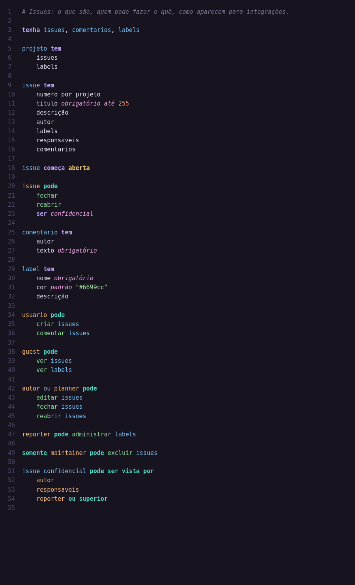

<p align="center">
  
</p>

# Germanio para VS Code

Suporte oficial à linguagem Germanio (`.ge`): ícone de arquivo, destaque de
sintaxe da linguagem de intenção, snippets, indentação automática e dois temas.



## Recursos

- **Ícone de arquivo** — todo `.ge` aparece com o cristal do Germanio.
- **Destaque de sintaxe que entende a intenção** — cada papel da frase tem sua cor:
  - frases de intenção (`tenha`, `tem`, `começa`, `crie página`, `quando`, `antes de`)
  - permissões (`pode`, `somente`, `permita`, `pode ser vista por`)
  - entidades (`issues`, `projetos`), papéis (`guest`, `maintainer`, `ou superior`)
  - ações (`fechar`, `editar`, `baixar código`), estados (`aberta`), campos
  - modificadores (`obrigatório`, `único`, `padrão`, `segredo`) e tipos (`número`, `lista de`)
  - lógica (`se`, `para cada`, `recuse`), módulos (`git.`, `markdown.`), strings com `{interpolação}`
  - palavras com ou sem acento (`descrição`/`descricao`, `página`/`pagina`)
- **Temas Germanio Escuro e Germanio Claro** — feitos para as cores acima (opcionais;
  o destaque funciona em qualquer tema).
- **Snippets** — `crie sistema`, `tem`, `pertence`, `tenha login`, `tenha papeis`,
  `pode`, `somente`, `começa`, `quando`, `antes`, `crie página`, `disponibilize`, `se`, `para cada`.
- **Editor** — comentários com `Ctrl+/` (`#`), indentação automática após
  cabeçalhos de bloco, dobra de blocos por indentação, 4 espaços.

## Instalação

```bash
cd vscode-germanio
npx @vscode/vsce package          # gera germanio-<versão>.vsix
code --install-extension germanio-*.vsix
```

Ou no VS Code: *Extensões → … → Instalar a partir do VSIX*.

## Desenvolvimento

A gramática e os temas são gerados; não edite os JSON à mão:

```bash
python3 tools/gerar_gramatica.py   # syntaxes/germanio.tmLanguage.json
python3 tools/gerar_temas.py       # themes/*.json
```

## Licença

MIT
